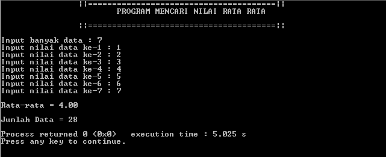

# Menghitung Nilai Rata-Rata

</a>

## Tech

Aplikasi ini dirancang menggunakan:

- [Visual Studio Code](https://code.visualstudio.com/docs/editor/vscode-web) : Visual Studio Code merupakan editor open source yang digunakan untuk pengembangan bahasa pemrograman.
- [C]: Bahasa pemrograman C adalah bahasa pemrograman tingkat tinggi. C adalah bahasa prosedural, portabel, efisien, dan struktural. Sintaksisnya sederhana, fleksibel, dan digunakan untuk berbagai jenis perangkat lunak.
